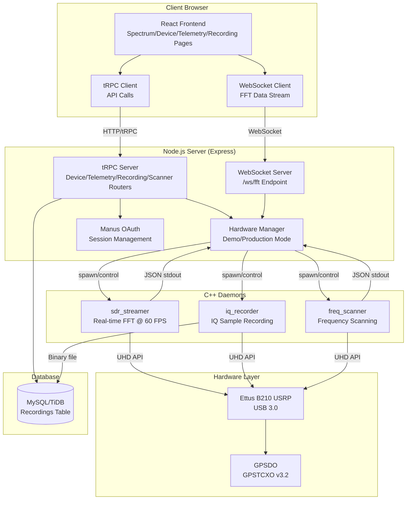
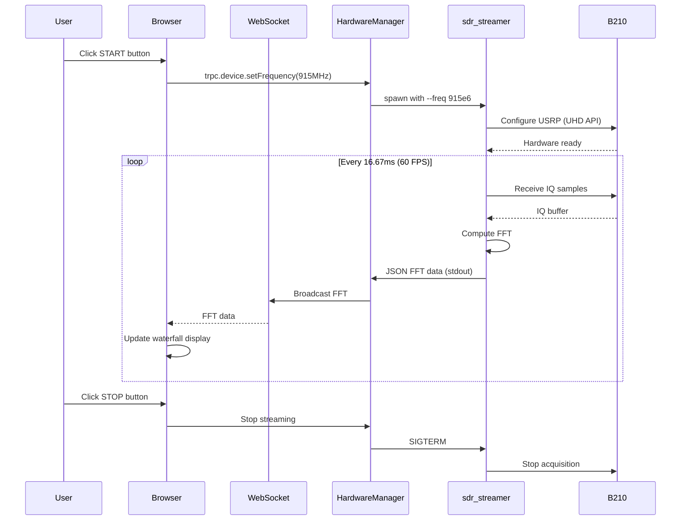

# Ettus B210 SDR Web Application - System Architecture

## Overview

The Ettus B210 SDR Web Application is a full-stack real-time software-defined radio control and visualization system designed for bare metal deployment on ARM64 hardware (gx10-alpha).

## System Architecture Diagram



## Data Flow Diagram



## Component Breakdown

### Frontend (React 19 + Tailwind 4)

**Pages:**
- `Spectrum.tsx` - Main dashboard with waterfall/spectrograph visualization
- `Device.tsx` - Hardware control (frequency, gain, sample rate)
- `Telemetry.tsx` - Real-time metrics (temperature, GPS/PLL lock, USB bandwidth)
- `Recording.tsx` - IQ sample recording management
- `Scanner.tsx` - Frequency scanning with peak detection
- `AIAssistant.tsx` - AI-powered SDR assistance

**Components:**
- `WaterfallDisplay.tsx` - WebGL-accelerated waterfall visualization
- `SpectrographDisplay.tsx` - SVG frequency-domain plot
- `SDRLayout.tsx` - Navigation and footer with device info

**State Management:**
- tRPC hooks for server communication
- WebSocket hooks for real-time FFT streaming
- React state for UI controls

### Backend (Node.js + Express + tRPC)

**Routers:**
- `device-router.ts` - Hardware control procedures (setFrequency, setGain, setSampleRate, getConfig, getStatus)
- `telemetry-router.ts` - Metrics query (getMetrics)
- `recording-router.ts` - Recording CRUD (list, start, delete)
- `scanner-router.ts` - Frequency scanning (startScan)

**Core Services:**
- `hardware.ts` - Hardware manager with demo/production mode
- `websocket.ts` - WebSocket server for FFT streaming
- `auth` - Manus OAuth integration
- `db.ts` - Database helpers

### C++ Daemons (UHD 4.x)

**sdr_streamer:**
- Real-time FFT computation at 60 FPS
- Outputs JSON to stdout: `{"timestamp": ..., "centerFreq": ..., "sampleRate": ..., "fftData": [...]}`
- Configurable via command-line args: `--freq`, `--rate`, `--gain`, `--fft-size`

**iq_recorder:**
- Records raw IQ samples to binary file
- Metadata stored in database
- Configurable duration and file path

**freq_scanner:**
- Scans frequency range with FFT analysis
- Outputs JSON peak detection results
- Configurable start/stop/step frequencies

### Database Schema

```sql
CREATE TABLE recordings (
  id INT PRIMARY KEY AUTO_INCREMENT,
  userId VARCHAR(255) NOT NULL,
  frequency BIGINT NOT NULL,
  sampleRate BIGINT NOT NULL,
  duration INT NOT NULL,
  filePath VARCHAR(500) NOT NULL,
  fileSize BIGINT NOT NULL,
  metadata JSON,
  createdAt TIMESTAMP DEFAULT CURRENT_TIMESTAMP,
  INDEX idx_user (userId),
  INDEX idx_created (createdAt)
);
```

## Deployment Architecture

```
gx10-alpha (ARM64 Ubuntu 22.04)
├── /opt/ettus-sdr-web/
│   ├── server/                 # Node.js backend
│   ├── client/dist/            # Built React frontend
│   ├── hardware/bin/           # C++ binaries (sdr_streamer, iq_recorder, freq_scanner)
│   ├── hardware/bin/uhd/       # UHD tools (uhd_find_devices, uhd_usrp_probe, etc.)
│   ├── recordings/             # IQ sample storage
│   ├── .env                    # Environment variables
│   └── package.json
├── /etc/systemd/system/
│   └── ettus-sdr-web.service  # Systemd service
└── /etc/nginx/sites-available/
    └── ettus-sdr-web           # Nginx reverse proxy
```

## Network Architecture

```
Internet
    ↓
[Nginx Reverse Proxy :80/:443]
    ↓
[Node.js Server :3000]
    ├── HTTP/tRPC API
    ├── WebSocket /ws/fft
    └── Static Files (React SPA)
```

## Security Considerations

1. **Authentication**: Manus OAuth with JWT session cookies
2. **Authorization**: User-scoped recording access via `userId` in database
3. **Network**: Nginx reverse proxy with HTTPS (Let's Encrypt)
4. **Process Isolation**: C++ daemons run as child processes, killed on error
5. **Resource Limits**: Systemd service with memory/CPU limits

## Performance Characteristics

- **FFT Rate**: 60 FPS (16.67ms latency)
- **WebSocket Throughput**: ~120 KB/s (2048-point FFT @ 60 FPS)
- **Database**: <10ms query latency for recording list
- **Frontend**: 60 FPS waterfall rendering via WebGL
- **Memory**: ~200 MB Node.js + ~50 MB per C++ daemon

## Monitoring & Logging

- **Application Logs**: `journalctl -u ettus-sdr-web -f`
- **Hardware Logs**: sdr_streamer stderr output
- **Metrics**: Telemetry router provides real-time hardware status
- **Health Check**: `/api/health` endpoint (TODO)

## Failure Modes & Recovery

1. **B210 Disconnected**: Hardware manager detects error, switches to demo mode
2. **C++ Daemon Crash**: Hardware manager respawns process automatically
3. **WebSocket Disconnect**: Client auto-reconnects with exponential backoff
4. **Database Unavailable**: Recording operations fail gracefully, UI shows error
5. **GPSDO Unlock**: Telemetry shows GPS lock status, continues operation

## Scaling Considerations

- **Single B210**: Current architecture supports one B210 per server
- **Multi-User**: Database and auth support multiple concurrent users
- **Multi-USRP**: Future enhancement requires hardware manager refactor
- **Distributed**: WebSocket broadcast can be extended to Redis pub/sub

## Technology Stack Summary

| Layer | Technology |
|-------|-----------|
| Frontend | React 19, Tailwind 4, TypeScript, WebGL |
| Backend | Node.js 22, Express 4, tRPC 11, TypeScript |
| Database | MySQL 8 / TiDB |
| Hardware | Ettus B210, UHD 4.x, GPSDO |
| C++ Daemons | C++17, UHD API, FFTW3, Boost |
| Deployment | Ubuntu 22.04 ARM64, systemd, Nginx |
| Auth | Manus OAuth, JWT |
